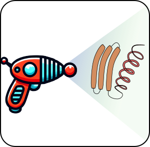

# Raygun: template-based protein design tool

Raygun is a new approach to protein design. Unlike de novo design tools
that generate a protein from scratch, Raygun allows users to take an
existing protein as template and modify it by introducing insertions,
deletions and substitutions. Our analyses showed that the modified
proteins significantly retained structural and functional properties of
the original template protein. We anticipate Raygun to be valuable in a variety 
of applications related to protein miniaturization, property optimization and so on.

-----

## Table of Contents

1.  [Raygun: Template-Based Protein Design Tool](https://github.com/rohitsinghlab/raygun?tab=readme-ov-file#raygun-template-based-protein-design-tool)
2.  [Preprint](https://github.com/rohitsinghlab/raygun?tab=readme-ov-file#preprint)
3.  [Recent Updates](https://github.com/rohitsinghlab/raygun?tab=readme-ov-file#recent-updates)
4.  [Introduction](https://github.com/rohitsinghlab/raygun?tab=readme-ov-file#introduction)
      * [How to Use Raygun](https://github.com/rohitsinghlab/raygun?tab=readme-ov-file#how-to-use-raygun)
      * [How Raygun Works](https://github.com/rohitsinghlab/raygun?tab=readme-ov-file#how-raygun-works)
5.  [Guidance on Using Raygun Effectively](https://github.com/rohitsinghlab/raygun?tab=readme-ov-file#guidance-on-using-raygun-effectively)
6.  [Requirements](https://github.com/rohitsinghlab/raygun?tab=readme-ov-file#requirements)
7.  [Installation](https://github.com/rohitsinghlab/raygun?tab=readme-ov-file#installation)
      * [From Source Repository](https://github.com/rohitsinghlab/raygun?tab=readme-ov-file#from-source-repository)
      * [Using pip](https://github.com/rohitsinghlab/raygun?tab=readme-ov-file#using-pip)
8.  [Using Raygun](https://github.com/rohitsinghlab/raygun/tree/adding-version-2?tab=readme-ov-file#using-raygun)
      * [Available models](https://github.com/rohitsinghlab/raygun/tree/adding-version-2?tab=readme-ov-file#available_models)
      * [Programmatically](https://github.com/rohitsinghlab/raygun/tree/adding-version-2?tab=readme-ov-file#programmatically)
10.  [Command-Line APIs: Training and Sampling](https://github.com/rohitsinghlab/raygun/blob/adding-version-2/README.md#training-and-sampling-apis)
      * [Generating Samples](https://github.com/rohitsinghlab/raygun?tab=readme-ov-file#generating-samples-raygun-sample-single)
      * [Training the Model](https://github.com/rohitsinghlab/raygun?tab=readme-ov-file#training-the-model-raygun-train)
11. [License](https://github.com/rohitsinghlab/raygun?tab=readme-ov-file#license)

-----

## Preprint 📜

**Devkota, K., Shonai, D., Mao, J., Soderling, S. H., & Singh, R.
(2024). Miniaturizing, Modifying, and Augmenting Nature's Proteins with
Raygun. bioRxiv, 2024-08.** [bioRxiv preprint](https://www.biorxiv.org/content/10.1101/2024.08.13.607858)

-----

## Updates 📢
**[Nov 3 - 3:00 pm] Updating the saved model on Zenodo to make it accessible to cpu-only systems.** 

**[May 20] Added Raygun version 0.2.**
  1. Due to the higher reconstruction accuracy of this new model (~96% median sequence recapitulation on all mouse and human sequences in SwissProt), we now recommend zero-shot usage of Raygun i.e., finetuning is unnecessary in most cases.
  2. Raygun now allows for batch sizes greater than 1.

-----

## Introduction 🧬
Raygun is a novel protein design framework that allows for
miniaturization, magnification and modification of any template
proteins. It lets the user select any protein as template and generates
structurally (and therefore, functionally) similar samples, while giving
full control over the lengths of the generated sequences.

**How to use Raygun:** Input a protein sequence, specify a target length
and a noise parameter. Raygun will use those information to efficiently
generate samples (< 1 sec/sample on a GPU). The users have complete
control over the length of the target protein.

**How Raygun works** Raygun is an autoencoder-based design which
represents any protein as a 64,000-dimensional Multivariate Normal
Distribution. The Raygun decoder has the ability to accurately map this
fixed-length representation back to the variable length space of the
user's specifications.

-----

### (Opinionated) Guidance on how best to use Raygun 💡
The thing that Raygun seems to do well is to preserve the general structure and return a candidate that will likely fold in vitro and retain *some* functional properties. However, the more of a handle you have on predicting/optimizing function, the more useful Raygun can be for you. This is especially the case if the starting template is an engineered protein so that its function was enhanced by previous optimization rounds. Raygun is very fast, so you can use it to generate lots of candidates and filter them down. We already do some of that, with pseudo-loglikelihood as a first pass. A good next filter might be using HMMER to prioritize candidates with relevant PFAM domains. If there're additional filters you can apply (e.g., thermostability), those might help. However, be aware that many DMS datasets used for property-prediction are probably suitable more for assessing substitutions than indels. That's where having an experimental pipeline to test a few initial candidates and optimize them in the lab would help.  

### Requirements 💻
Raygun has a few package requirements: `numpy`,
`pandas`, `fair-esm`, `pyyaml`, `h5py`, `einops` and `torch`
(the version suitable for your GPU). We verified that our model works on
A100 and A6000 GPUs, for the following specifications:

-   fair-esm=2.0.0
-   numpy=1.26.4
-   pandas=2.1.4
-   pytorch=2.1.1 (py3.11_cuda12.1_cudnn8.9.2_0)
-   lightning (especially for training)
-   hydra (only for training)

-----

## Installation ⚙️

### From source repository

Users can install Raygun directly from source by cloning the github repo
<https://github.com/rohitsinghlab/raygun> and installing the package
through pip.

``` bash
git clone https://github.com/rohitsinghlab/raygun
cd raygun
pip install . #note that the code will be copied to the environment's packages directory, so your localdir changes will not be reflected unless you reinstall
```

### Using pip

Alternately, users can install raygun from the pip repository

``` bash
pip install git+https://github.com/rohitsinghlab/raygun.git
```
-----

## Using Raygun  🚀

### Available models 

Two Raygun models are currently available for users.

| model name          | Trained on         | Release date | Version  |
|---------------------|--------------------|--------------|----------|
| raygun_2_2mil_800M  | 2.2 mil Uniref50   | May, 2025    |   0.2    |
| raygun_100k_750M    | 100K Uniref50      | Aug, 2024    |   0.1    |

We highly recommend the latest 800M parameter model that was trained on 2.2 million randomly sampled dataset to be used for generation and sampling.

Here is how you would obtain fixed-length embeddings and generate new sample(s) programmatically. Later, we also describe how to do this via the command line. 

### Programmatically

**1. Load the Raygun model**
```
## set the seeds to ensure repeatability

## loading the model

from raygun.pretrained import raygun_2_2mil_800M
raymodel = raygun_2_2mil_800M().to(0)
```

**2. Also load the ESM-2 650M model (Raygun accepts as input ESM-2 650M embeddings)**
```
# esm-2 model
from esm.pretrained import esm2_t33_650M_UR50D
esmmodel, alph = esm2_t33_650M_UR50D()
bc             = alph.get_batch_converter()
esmmodel       = esmmodel.to(0)
esmmodel.eval()
```

**3. Get the ESM-2 embedding of the input sequence**
```
# data is a list of (id,sequence) pairs
data = [("egfp", "MVSKGEELFTGVVPILVELDGDVNGHKFSVSGEGEGDATYGKLTLKFICTTGKLPVPWPTLVTTLTYGVQCFSRYPDHMKQHDFFKSAMPEGYVQERTIFFKDDGNYKTRAEVKFEGDTLVNRIELKGIDFKEDGNILGHKLEYNYNSHNVYIMADKQKNGIKVNFKIRHNIEDGSVQLADHYQQNTPIGDGPVLLPDNHYLSTQSALSKDPNEKRDHMVLLEFVTAAGITLGMDELYK")]
_, _, tok = bc(data)
# return esmemb
esmemb       = esmmodel(tok.to(0), repr_layers = [33],
                        return_contacts=False)["representations"][33][:,1:-1]  #remember to remove the start and end tokens!
# esmemb.shape should be torch.Size([1, 239, 1280])
```

**4.1 Generation: reconstruct the sequence i.e. the same length with zero noise)**
```
# this is for batchsize=1; see the notebooks for batchsize > 1 (e.g., a mask will be needed if batch sequences are of varying lengths).
results = raymodel(esmemb, 
                  return_logits_and_seqs = True)
```

**4.1.1 Obtaining the fixed-length representation** 
The fixed-length representation can be obtained from the `results` dictionary by using the key `fixed_length_embedding`
```
results["fixed_length_embedding"].shape
```
Expected Output:
```
torch.Size([1, 50, 1280])
```

**4.2 Generate with indels and substitutions, i.e., change the target length and add some noise**
If the users desire to modify the template length and add some noise, two additional parameters: `target_lengths` and `error_c` should be provided as input to the Raygun model.
```
target_len = torch.tensor([210], dtype = int)
error      = 0.1 # we recommend noise between 0 and 0.5, larger values provide more sequence diversity

results    = raymodel(esmemb, target_lengths = target_len, error_c = error,
                      return_logits_and_seqs = True)
results["generated-sequences"], len(results["generated-sequences"][0])
```
Expected Output (your sequence may vary a bit, due to noise):
```
(['MVSKGEELFTGVVPILVELDGDVNGHKFVSGEEDTAYLKLTKFITTGKPVWPTTLTTTYGQCFRRPHHKQHFFKSAPEGYQQRTIFKDDGNYKTRAEVKFEGDTLVNRIELKGIDFKEDGNILGHKLEYHYNSNIIMADKKKGIKKFKRHNIDGSVLDAYHQTPIGDGVLLPDHYLTQSALKNPEKRDHMVLLEFVTAAGITLGMEEYYK'],
 210)
```

More examples on batching/usage of dataloaders to streamline the generation/training operation are provided in the ipynb files in the notebook folder.

## Training and sampling APIs

We also additionally provide two command-line APIs `raygun-sample-single` and `raygun-sample-multiple`, and one python code `raygun/commands/train.py` for raygun-based generation and training respectively. These are described below

### Generating samples

After the raygun package has been installed, you can use it to generate
samples using the `raygun-sample-single` command.  For most users, 
`raygun-sample-single` should be all you need.

~~We strongly recommend that the user first fine-tune the model on the
target sequence or a set of related sequences.~~

**Update**
Unlike Version 1, the latest model only requires finetuning on rare cases where the sequence identity of the pretrained v0.2 model is < 0.90 (in contrast, the median sequence identity observed on all of Swissprot Human and Mouse sequences were ~0.96)


`raygun-sample-single` accepts a FASTA file with only one sequence record (if more than one records provided, it only takes the first entry). The program can be invoked the following way:

``` bash
raygun-sample-single --minlength <minlength> --maxlength <maxlength> --noiseratio <error>  \
              --num_raygun_samples_to_generate 50 <template-fasta-file> <output-folder>
```
Here, `template-fasta-file`, `output-folder`, `--minlength` and `--maxlength` are required arguments. 
The sampling process internally uses PLL based filtering to select for the most sequentially viable candidates. 
`--num_raygun_samples_to_generate` tells the program the number of sequences to be outputted after PLL filtering.
`--sample-ratio` refers to the total number of sequences for Raygun to generate before the filtering operation. A sample
ratio of 10 implies that 500 sequences has to be generated to finally return 50 filtered candidates as output.

`raygun-sample-multiple` lets user accept FASTA files with more than one entries. The modification here is that the users should provide length information of these records in a JSON file format, of the form
```
{ "record1": [minlength, maxlength],
...
}
```
One can invoke `raygun-sample-multiple` the following way
```
raygun-sample-single --leninfo <Length json file>  <template-fasta-file> <output-folder>
```
Additionally, in the rare case that the off-the-shelf sequence reconstruction of the template is poor, both `raygun-sample-single` and `raygun-sample-multiple` allows finetuning (as our earlier model) by enabling the `--finetuning` option. For detailed instructions, please look at the `example_sh` folder for working examples. 

### Training the model

We have provided the raygun training code in the `raygun/commands/train.py` file. The training procedure heavily relies on the Lightning framework for multi-gpu training. The hydra configuration file containing all the necessary inputs to the training code is provided in the `example_configs/version2` folder.

We can invoke the train command in bash the following way
``` bash
python raygun/commands/train.py --config-path example_configs/version2 devices=<no_devices> \ 
                           model_saveloc=<saveloc> trainfasta=<tfastafile> validfasta=<vfastafile> 
```

The configuration file `example_configs/version2/train.yaml` has additional parameters that can be modified.
``` YAML
devices: null           #required
model_saveloc: null     #required
trainfasta: null        #required
validfasta: null        #required
epoch: 10
num_to_save: 3
lr: 0.00002

esm2_embedding_saveloc: null # if specified, the ESM-2 embeddings will be saved here.

###### Section 3: OTHER PARAMETERS ########
## you can ignore these for now
reconstructionlossratio: 1
replicatelossratio: 1
crossentropylossratio: 1
maxlength: 1500
minallowedlength: 55
clip: 0.0001
batch_size: 2
accumulate_grad_batches: 1

log_wandb: false
```
Note that this training code is provided as a baseline reference. Any modifications on this code to improve the training procedure is highly encouraged.

## License
Everything in this repository is licensed under the CC-BY-NC-SA 4.0 license. In addition to the terms of this license, we grant the following rights:

 - Employees of governmental, non-profit, or charitable institutions (including most academic researchers) are permitted to use Raygun as part of a workflow that results in commercial products or services. For example, if you are an academic who creates a molecule using Raygun and wish to commercialize it, you are welcome to do so.

 - For-profit organizations are allowed to use Raygun for public-domain outputs, such as publications or preprints. Additionally, these organizations are granted a 60-day trial license for internal evaluation purposes. Continued use beyond the trial period or for any commercial activities will require a separate license agreement.

