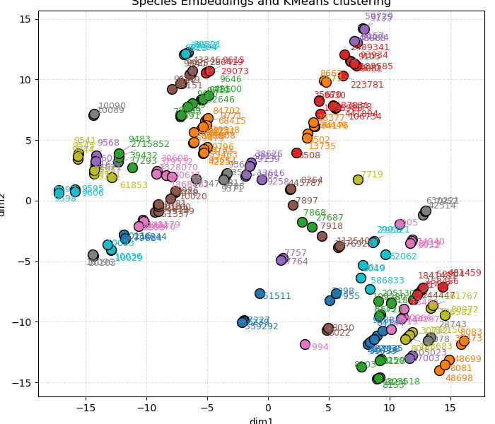

# Update December 2

## Dataset Generation

For each human sequence in Swissprot, we queried the Ensemble database to obtain their orthologs across species. This, in total, returned ortholog sequences for 11,238 human proteins. We used `mmseqs`
on the queried human sequences to divide the orthologs into `train`, `test` and `validation` sets in a `7:2:1` ratio. The resulting train split consisted of 7824 ortholog groups and 1,396,017 sequences
in total.

Along with the ortholog sequence, Ensembl also returns its taxonomy id, sequence identity and other information in a json format, given the queried input human sequence. In total, we obtained orthologs 
from 200 species. The taxonomy-id and the k-means clustering, that visualizes the taxonomic distances between the ids is shown in Figure below.

The RayFlow training step accepts the following core inputs: the starting sequence $s_{seq}$, the starting taxonomy id $s_{tax}$, the target ortholog sequence $t_{seq}$ and the target taxonomy
id $t_{tax}$. It is necessary that the $t_{tax}$ is evolutionarily far away from $s_{tax}$, while the two sequences share the same ortholog group. The notion of nearby and faraway taxonomies are 
further reinforced into the Rayflow model by introducing another sequence input: $s_{sametax}$, which is a sequence that is different in fuction than $s_{seq}$ and $s_{tax}$ but its corresponding
species is closer in the evolutionary sense to $s_{tax}$. Thus, goal of a Dataloader is to provide the Rayflow training loop with these three sequence inputs. 

We accomplish this by implementing the `loader.RaygunContrastiveDataset` class the following way:
1. Select a protein $s_{seq}$ randomly and get its $s_{tax}$
2. Find its ortholog group $G$ and randomly select a protein from the group while ensuring that the sequence belongs to a reasonably distant taxonomy: $t_{tax}$ and $t_{seq}$
3. Randomly select a taxonomy that is closer to $s_{tax}$ than $s_{tax}$ is to $t_{tax}$. Randomly, sample a protein belong to that taxonomy, while ensuring that its ortholog group is not $G$. Call this $s_{sametax}$

## Model Objectives and Traning

The model architecture is the same as that of the original Raygun. What we changed were the model objectives. The training objective is composed of three broadly orthogonal tasks:
1. The first task, exactly the same as the original Raygun objective, ensures that the sequences compressed by the Raygun encoder layer is recapitulated back with high accuracy.
2. The second task tries to re-inforce the same-function/different-function and same-taxonomy/different-taxonomy dichotomy directly into Raygun's fixed length representation through contrastive learning.
3. The third and the final task, tries to transfer the fixed length representation belonging to $s_{seq}$ to that belonging to $t_{seq}$ while ensuring high accuracy.

