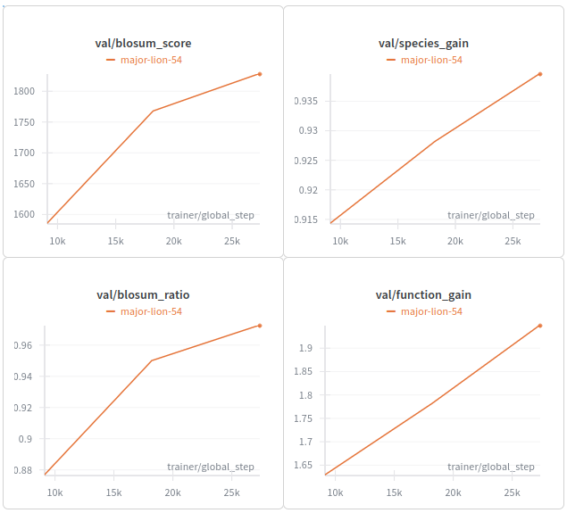
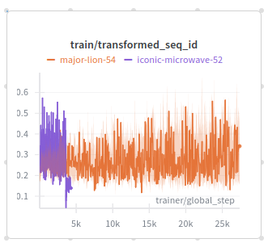

# Update December 2

## Dataset Generation

For each human sequence in Swissprot, we queried the Ensemble database to obtain their orthologs across species. This, in total, returned ortholog sequences for 11,238 human proteins. We used `mmseqs`
on the queried human sequences to divide the orthologs into `train`, `test` and `validation` sets in a `7:2:1` ratio. The resulting train split consisted of 7824 ortholog groups and 1,396,017 sequences
in total.

Along with the ortholog sequence, Ensembl also returns its taxonomy id, sequence identity and other information in a json format, given the queried input human sequence. In total, we obtained orthologs 
from 200 species. The taxonomy-id and the k-means clustering, that visualizes the taxonomic distances between the ids is shown in Figure below.


The RayFlow training step accepts the following core inputs: the starting sequence $s_{seq}$, the starting taxonomy id $s_{tax}$, the target ortholog sequence $t_{seq}$ and the target taxonomy
id $t_{tax}$. It is necessary that the $t_{tax}$ is evolutionarily far away from $s_{tax}$, while the two sequences share the same ortholog group. The notion of nearby and faraway taxonomies are 
further reinforced into the Rayflow model by introducing another sequence input: $s_{sametax}$, which is a sequence that is different in fuction than $s_{seq}$ and $s_{tax}$ but its corresponding
species is closer in the evolutionary sense to $s_{tax}$. Thus, goal of a Dataloader is to provide the Rayflow training loop with these three sequence inputs. 

We accomplish this by implementing the `loader.RaygunContrastiveDataset` class the following way:
1. Select a protein $s_{seq}$ randomly and get its $s_{tax}$
2. Find its ortholog group $G$ and randomly select a protein from the group while ensuring that the sequence belongs to a reasonably distant taxonomy: $t_{tax}$ and $t_{seq}$
3. Randomly select a taxonomy that is closer to $s_{tax}$ than $s_{tax}$ is to $t_{tax}$. Randomly, sample a protein belong to that taxonomy, while ensuring that its ortholog group is not $G$. Call this $s_{sametax}$

## Model Objectives and Traning

We changed both the Raygun model architecture and the model objectives. The training objective is composed of three broadly orthogonal tasks:
1. The first task, exactly the same as the original Raygun objective, ensures that the sequences compressed by the Raygun encoder layer is recapitulated back with high accuracy.
2. The second task tries to re-inforce the same-function/different-function and same-taxonomy/different-taxonomy dichotomy directly into Raygun's fixed length representation through contrastive learning.
3. The third and the final task, tries to transfer the fixed length representation belonging to $s_{seq}$ to that belonging to $t_{seq}$ while ensuring high accuracy.

### Architecture changes
The third task required changes in the underlying Raygun architecture. We did this by changing the `Block` layer. The original Raygun `Block` implementation accepted only one embedding input `x`. In 
this new version, we give users an option to add in another embedding input through the `species_emb` parameter. The new Block looks like this:
```
class Block(nn.Module):
    def __init__(self, dim = 2560, attnheads = 5, convkernel = 7):
        super(Block, self).__init__()
        self.encoder    = TransformerLayer(embed_dim = dim, 
                                          ffn_embed_dim = 2 * dim,
                                          attention_heads = attnheads,
                                          use_rotary_embeddings = True)
        self.sp_emb_proc = nn.Sequential(
                               nn.Linear(dim*2, dim//2),
                               nn.SiLU(),
                               nn.Linear(dim//2, dim*2))
        self.convblock   = ConvBlock(dim, convkernel)
        self.final       = nn.Linear(dim // 2, dim)
        
    def forward(self, x, mask = None, species_emb=None):        # Changes here
        x    = rearrange(x, "b n c -> n b c")
        x, _ = self.encoder(x, self_attn_padding_mask = ~mask 
                            if mask is not None else mask) 
        x    = rearrange(x, "n b c -> b n c")
        if species_emb is not None:
            c_emb  = torch.concat([species_emb, x.mean(dim=1)], 
                                 dim=1)
            sc, sp = c_emb.chunk(2, dim=1)
            x      = x * sc.unsqueeze(1) + sp.unsqueeze(1)
        x    = self.convblock(x, mask = mask)
        return self.final(x)
```
The downstream effect of this is that now Raygun can directly accept the `source embedding`, `source taxonomy` and `target taxonomy` and return the `target embedding`.
Only the Raygun encoder blocks are modified. The decoder blocks remain the same.

The new Raygun inputs are shown in the code block below:
```
def forward(self, x, 
            start_species=None,
            target_species=None,
            mask = None, 
            target_lengths = None, 
            noise = None, 
            token = None, 
            return_logits_and_seqs = False,
            temperature=None, 
            include_valid_only=True):
    """
    Arguments:
    x    -> [batch, seq, dim]: ESM-2 650M embedding
    mask -> [batch, seq]: Binary matrix. Suppose the sequence length of a  `batch_id` is `n`. Then mask[batch_id] should be such that mask[batch_id, :n] = 1 and mask[batch_id, n:] = 0  
    output_lengths -> [batch]: target length
    """
```
If the `start_species` and `target_species` are not supplied, the model behaves like the original Raygun.

### Contrastive learning
To accomplish the contrastive learning task, we divided the $\mathbb{R}^{50\times 1280}$ fixed-length spaces into two subspaces $F \oplus S$, where  $F=\mathbb{R}^{50\times 1270}$ and $S=\mathbb{R}^{50\times 10}$. Then, taxonomic distance and functional relationships between $s_{seq}, t_{seq}$ and $s_{sametax}$ were imparted into the model through the following approach:
1. Triplet loss between $F_{s}, F_{t}, F_{sametax}$ (i.e. $F_{t}$ should be closer to $F_{s}$, as they belong to the same ortholog group).
2. Triplet loss between $S_{s}, S_{sametax}, S_{t}$ (i.e. $S_{sametax}$ should be closer to $S_{s}$, as they are closer taxonomically).

The triplets here are computed by applying the model individually to the `source`, `target` and `sametax` squences, and obtaining the two triplet losses.

#### Raygun and contrastive results
To ensure that the model does not get stuck on the original Raygun objective of perfect sequence reconstruction, we trained the model from scracth. Even then, in the first few epochs, the model 
was able to obtain a respectable BLOSUM score and function gains. 



###  Species Transformation
Our first attempt at species transformation used the updated Raygun encoder to accept the source embedding, the source taxonomy and target taxonomy tokens, and return logits belonging to the target sequences. We then computed MSE and cross-entropy loss against the ground truth sequence and ESM embeddings which is available during training. The denoising loss computation code is located at line 217-254 of the `rayflow/ltrayflow.py` file.

The species-transformation training results, however, stalled at around 0.4.  




